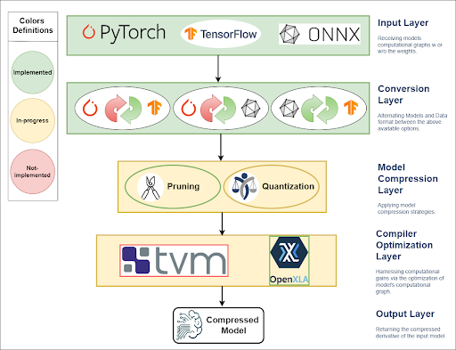

<br>
<div align="center">
</img>
<h2></h2>
<h3>Inference Optimization Workflow<h3>

</div>

RefMap inference optimization pipeline is a workflow for deep learning models optimization with the following features:

* **RefMap Inference Optimization Toolkit:** This framework aims at the optimization deep learning models within the RefMap framework, ensuring their sustainability and efficiency under realistic use-case constraints. It addresses both the memory and latency limitations of resource-constrained devices used for model deployment in real-world conditions. This involves refining models at both structural and computational levels to meet these objectives. The framework is designed to support most widely used ML frameworks, i.e. PyTorch, TensorFlow, and ONNX. It implements a two-fold inference optimization process, providing greater abstraction and flexibility in optimization choices for specific use cases. Specifically, the two levels of optimization that are designed to be incorporated into the framework are; (a) **Model Compression**, that targets the model structure in a hardware-agnostic manner, offering general-purpose solutions and eliminating the need to specify the exact hardware backend for deployment and (b) **Compilation Optimizations**, that focuses on incorporating hardware specifications into the optimization process to enhance model computations during execution. In that way, this comprehensive approach ensures the framework can adapt to a variety of deployment scenarios while maintaining efficiency and performance.
* **[Examples](compiler_optimization/examples/)**: Play around with off-the-shelf compiler optimizations for [turbulence prediction models](https://www.cambridge.org/core/services/aop-cambridge-core/content/view/3CE4E78C5BAFB370A10BB736A78D3DB6/S0022112021008120a_hi.pdf/convolutional-network-models-to-predict-wall-bounded-turbulence-from-wall-quantities.pdf).  
* **[Benchmark](model_compression/benchmarks/)**: Explore and experiment with various pruning methods and configurations for general-purpose model compression.

For more technical details, please refer to our published papers:

**TBA**

### Update:

* 2024.09.13 [Structural Pruning for PyTorch Models](https://github.com/CaffeineOverflowAngeL/RefMap_Inference_Optimization_Workflow/model_compression) 
* 2024.09.10 [Compiler Optimization for TensorFlow Models using OpenXLA](https://github.com/CaffeineOverflowAngeL/RefMap_Inference_Optimization_Workflow/tree/main/compiler_optimization)
* 2024.09.10 [Cross-Framework ML Model Converter](https://github.com/CaffeineOverflowAngeL/RefMap_Inference_Optimization_Workflow/tree/main/fcn_turbolence_prediction/src)

### **Contact Us:**
Please do not hesitate to open an [issue](https://github.com/CaffeineOverflowAngeL/RefMap_Inference_Optimization_Workflow/issues) if you encounter any problems with the pipeline or the related papers.   

## Installation

Refmap inference optimization workflow is compatible with Python 3.x. The pipeline is compatible with multiple ML frameworks, including (a) PyTorch 1.x and 2.x (with a strong recommendation for PyTorch 1.12.1 or later), (b) TensorFlow 2.x, and (c) ONNX 1.x.

```bash
git clone https://github.com/CaffeineOverflowAngeL/RefMap_Inference_Optimization_Workflow
```

#### DepGraph

[DepGraph](https://openaccess.thecvf.com/content/CVPR2023/papers/Fang_DepGraph_Towards_Any_Structural_Pruning_CVPR_2023_paper.pdf) is a versatile framework for automatic structural pruning across various neural network architectures and is natively built on Pytorch. For more information please refer to their [GitHub](https://github.com/VainF/Torch-Pruning) page.
